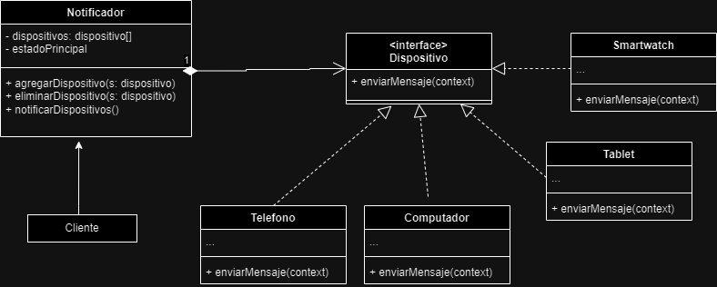

jose guzman 
abril 
bryam

Para el segundo caso, fue necesario usar un observer, tal como se observa
en el siguiente diagrama uml. El problema que poseaiamos era
para un patron de comportamiento, ya que a la hora de 
notificar se debia hacer al mismo tiempo a todos los 
dispositivos del cliente. Por tanto era necesario esta solucion con ese patron.

